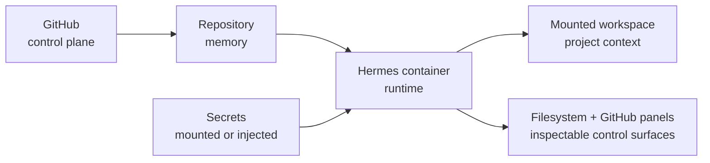

# Start Here

Hermes gives you a reproducible runtime, a mounted workspace, a visible filesystem, a GitHub panel, and a safe secrets model.

The shortest path is:

1. Copy `.env.example` to `.env`.
2. Run `make init-working-group` and `make doctor`.
3. Build and launch the stack.
4. Open the gateway, CMS/filesystem, and JupyterLab.
5. Run `make smoke-test`.

Keep this in mind:

